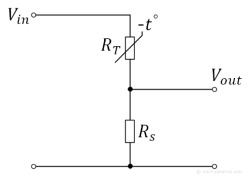

# UART TEMPERATURE SENSOR DEVICE

## Brief Description
This is a UART temperature sensor device that uses Atmega32 as it's microcontroller, along with [GA2.2K3A1i(A)](https://www.te.com/commerce/DocumentDelivery/DDEController?Action=showdoc&DocId=Data+Sheet%7FGA2.2K3A1i%7FA%7Fpdf%7FEnglish%7FENG_DS_GA2.2K3A1i_A.pdf%7F11028086-00) thermistor and simple voltage divider circuit to measure temperature at sampling frequency equal to 10HZ. The device is designed to act as a UART slave device where it samples the data at the mentioned frequency, saves it to a circular buffer (older data is discarded), and send the whole buffer to any master device that requests it. The master device can ask our device to send the buffer using AT commands. Temperature range between 0 - 50 C with resolution equal to 0.1 C. RTOS is not used in this project.

## Detailed Description 

### Hardware Detailes
 
**where:**
* V~in~ = 3.3V.
* R~s~ = 2.43kohm.
* R~t~ is the resistence of the NTC thermistor.
* V~out~ is connected to the ADC channel of the MCU.

the R~s~ resistance value was choosen to maximize divider output voltage swing using the geometric mean [formula](https://electronics.stackexchange.com/questions/604169/choosing-register-value-for-ntc-with-voltage-divider).

### Software Detailes
The device starts taking samples right after it's powered up. Each obtained ADC reslut is converted to the corresponding resistance value using predefined equation. Then, using *steinhart-Hart equation*, the temperature value corresponding to that resistence value is found. Finally the obtained Temperature value goes through a moving average filter where it's filtered and saved to the circular buffer. 

For the AT command handler, the UART is configured to interrupt at every message receiving event. Received charcters get saved to a buffer one by one until the end of the command is encounterd. At this point, the buffer containing the command is sent to a a specific function where it's handled.

## How To Build And Run
Code was written completely on the [Microchip Studio for AVR](https://www.microchip.com/en-us/tools-resources/develop/microchip-studio) IDE. The only nessecary step is choosing the right microcontroller (Atmega32 in this case) and your good to go.

